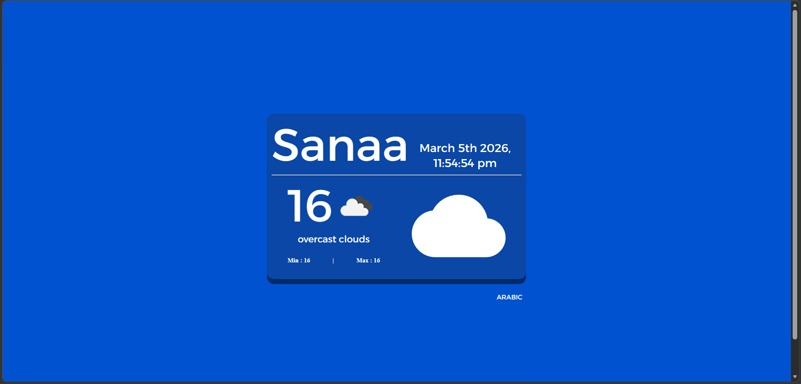

# Weather Project 🌤️

مشروع ويب تفاعلي يعرض حالة الطقس في أي مدينة باستخدام React و Material-UI، مع دعم **اللغتين العربية والإنجليزية**.

يمكنك مشاهدة المشروع مباشر على: [weatherprojectabboud.netlify.app](https://weaterprojectabboud.netlify.app)

---

## 📝 وصف المشروع

- عرض حالة الطقس الحالية للمدينة المختارة
- عرض:
  - درجة الحرارة الحالية
  - أقل وأعلى درجة حرارة
  - وصف الطقس (غائم، مشمس، إلخ)
- تغيير اللغة بين العربية والإنجليزية بسهولة
- الوقت والتاريخ الحالي للمدينة
- أيقونات توضيحية لحالة الطقس

---

## ⚙️ التقنيات المستخدمة

- [React](https://reactjs.org/)
- [Material-UI](https://mui.com/)
- [Axios](https://axios-http.com/) لجلب بيانات الطقس من API
- [Moment.js](https://momentjs.com/) لعرض الوقت والتاريخ
- [i18next](https://www.i18next.com/) + [react-i18next](https://react.i18next.com/) لدعم الترجمة

---

## 🗂️ هيكل المشروع
